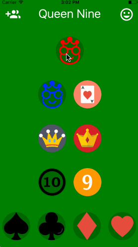

# Queen Nine

  

## Inspiration
Every summer, my friends and play a crazy amount of the card game [Euchre](https://en.wikipedia.org/wiki/Euchre). However, virtually every game we play leads to arguments about calling trump (that is, the decision of whether a player's hand has enough cards of one suit to declare it the "trump suit"). After one member of our group tried to advocate for his call with only a queen and a nine of trump in his hand (a very sketchy call at best), I decided that some hard data about calls needed to be collected, and the Queen Nine app was born. We have recorded hundreds of calls already, and I hope to extend the app to use the data in a predictive capacity once enough data is collected.

## How it works
With the app, a player logs in with his username and password before the game starts. Then each time he calls trump, he selects the cards in his hand, the trump suit, the rating of the non-trump cards in his hand (either plus, minus or neutral), and whether he and his teammate won or lost the hand. I designed the app to be as simple and quick as possible, so that calls could be logged as the deck is being shuffled for the next hand.

## Technology
The app is made in React Native, so it's compatible with both ios and android phones, and hosted on Expo, so that I could avoid buying expensive developer certificates and use the app as quickly as possible. The back-end is also [hosted on Github](https://github.com/owenauch/queen-nine-backend), and uses Node.js, Express, and MongoDB. Tests, though still sparse (for now), are writted using Jest. All these technologies were a blast to use, and made developing the app incredibly quick and enjoyable.

## How can I use it?
If you just want to check it out, download the Expo app on your device, and enter the link `exp://exp.host/@owenauch/queen-nine` to access the project. If you actually want to contribute call data, send me an email at owenauch@wustl.edu, and I can send you the secret code to create an account.
